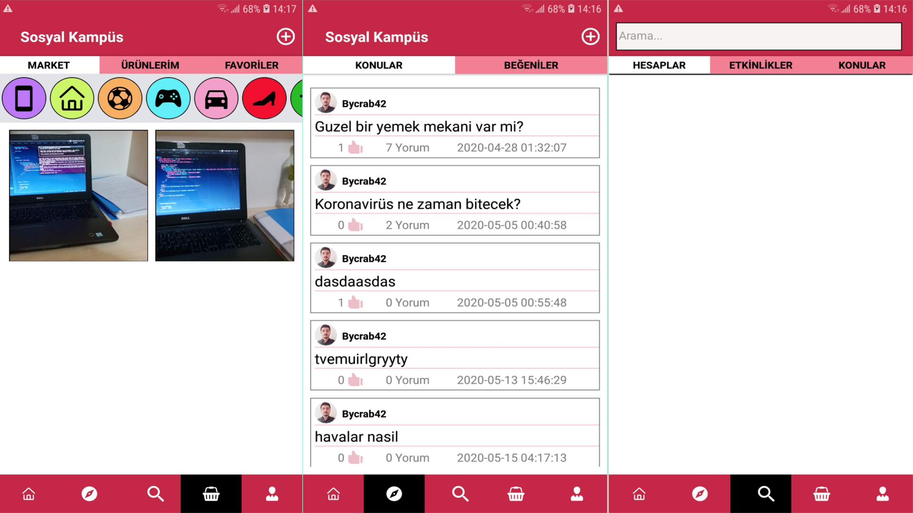
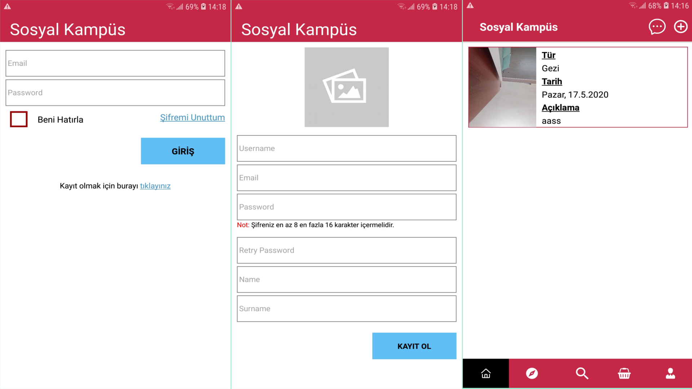
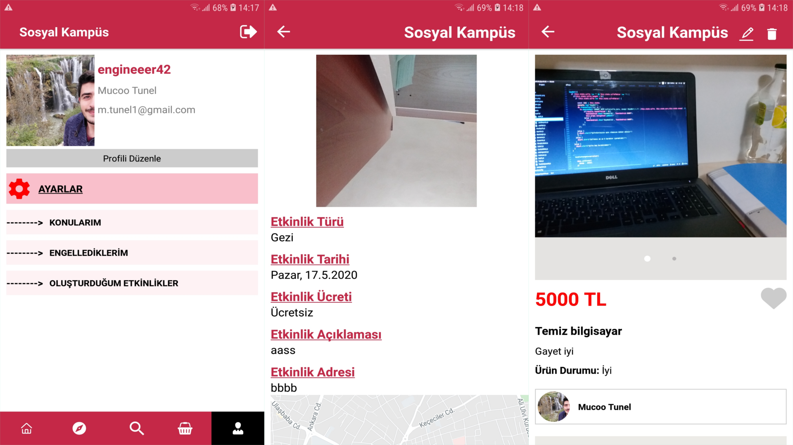

# Sosyal Kampüs

Sosyal kampüs uygulaması kullanıcılar arasında iletişim kurmayı saylayan bir sosyal medya uygulamasıdır. 

## Kullanılan Teknolojiler

1. React-Native
2. Node.js
3. Python-Django
4. Socket.io
5. Firebase

## Uygulama Görüntüleri

